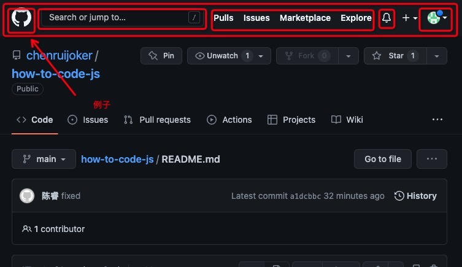

# 如何声明变量

说白了前端三板斧：`html`、`js`、`css`,`html` 内容比较少，更多是`css`和`js`的变量声明。

**本文目录**

-   [html 标签或组件标签使用技巧]()
-   [声明 css、scss or less 变量](#声明-cssscss-变量)
-   [声明 js 变量](#声明-js-变量)
    -   [声明基本变量](#声明基本变量)
    -   声明 API 函数变量
    -   声明普通函数变量
-   声明 React 组件

---

## html 标签或组件标签使用技巧

不论是组件还是正常的 html 标签，说是标签内容里面没有内容我们一律使用`自闭包`写法，目的也很简单，代码更加简洁，一下子也能判断你的组件是否支持 `内部嵌套` 之类的情况

```html
<div>
    
    <!-- 下面的写法避免写 -->
    <!-- </img> -->
</div>
```

## 声明 css、scss or less 变量

这里以 github 网页为例子



一般而言，我们会更根据业务用途、布局关系来进行样式变量的声明，以该图为例，首先一这是一整个顶部 header，里面有头像,搜索框，操作导航，消息提示，github 的 logo，所以这个部分的样式渲染应该是写成这样

`小写-小写`风格

```html
<div class="top-header">
    
    <input class="search-input-bar" />
    <div class="navigation-bar">
        <button class="navigation-button">Pulls</button>
        <button class="navigation-button">Issues</button>
        <button class="navigation-button">Marketplace</button>
        <button class="navigation-button">Explore</button>
    </div>
    
    
</div>
```

至于某一些场景中我们会在头部中有两个 search 框，那也可以考虑按照位置去命名，比如`left-search-bar` 或者 `right-search-bar`

另外像是 scss 或者 less 这种预编译语法我们最好还是在组件最外层去声明一个变量，然后组件里面的 class 命名就全都包裹进里面,这样的好处也是避免了样式污染

`scss-example`

```scss
.top-header {
    .github-logo {
    }
    .search-input-bar {
    }
    .navigation-bar {
        .navigation-button {
        }
        // 由于这个button的样式是针对navigation独有的，所以甚至可以不需要navigation-button而直接使用 button
    }
    .message-bell {
    }
    .avatar {
    }
}
```

## 声明 js 变量

### 声明基本变量

我们一般声明变量基本上都是按照 **`业务内容`** 去声明变量

我们最好采用`小驼峰命名`

```javascript
let userInfo = {};
let list = [];
let fatherName = "";
```

当然并不是说所有的业务内容都适合采用这种方式,有时候我们对于某些特殊场景需要用到一些常量数据，为了快速在业务代码中分辨哪些是不可变更常量数据哪些是可变业务数据，我们往往会把常量数据单独提出来放在另一个 js 文件中，让业务代码去引用

我们采用`大写+下划线的方式`

```javascript
export const LIST = [];
export const MOCK_DATA = {};
```
